# Mono2Micro

This document explains about how to Download, install and run Mono2Micro tool.

## 1. Download Mono2Micro

<details><summary>CLICK ME</summary>


### 1.1 Download Mono2Micro CLI

1. Download the `Mono2Micro-CLI.zip`

```
curl https://public.dhe.ibm.com/ibmdl/export/pub/software/websphere/wasdev/mono2micro/Mono2Micro-CLI.zip --output Mono2Micro-CLI.zip
```

2. Unzip the file

```
unzip Mono2Micro-CLI.zip -d Mono2Micro-CLI
```

### 1.2 Download Examples

1. Download the `Mono2Micro-Example.zip` from the url https://www.ibm.com/support/pages/node/6333537

2. Unzip the file

```
unzip Mono2Micro-Example.zip -d Mono2Micro-Example
```

You can see the detailed IBM documentation <a href="https://www.ibm.com/docs/en/mono2micro?topic=mono2micro-downloading-installing">here</a>.

</details>

## 2 Install Mono2Micro trail version

<details><summary>CLICK ME</summary>

### 2.1. Run the CLI

1. Get into the cli folder

```
cd Mono2Micro-CLI
```

2. Run the CLI to see the available commands

```
./mono2micro
```

you may see the output like this.

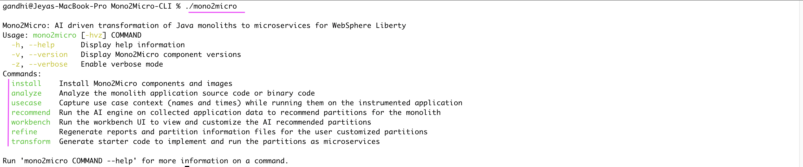

### 2.2. Install Mono2Micro 

1. Run the install help command

```
./mono2micro install -h
```

You can see the output like this. The trail license for the Mono2Micro is `1. IBM Mono2Micro 24.0.03 trial (L-xxxxxxxxxxxxxxxxx`. So you need to choose the option as `1` in the upcoming command.

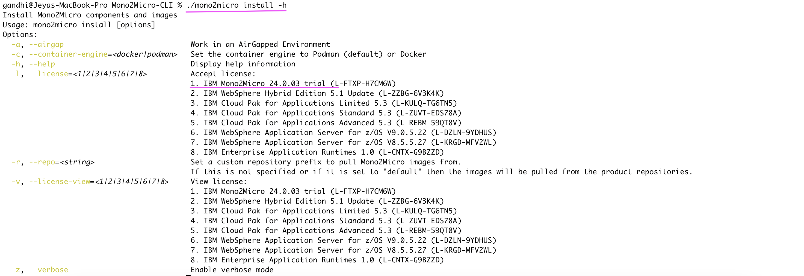

2. Run the below command to install mono2micro if you have docker.

```
./mono2micro install -l=1 -c=docker
```

Use the below command to run install mono2micro, if you have podman.

```
./mono2micro install -l=1 -c=podman
```

you may see the output like this.

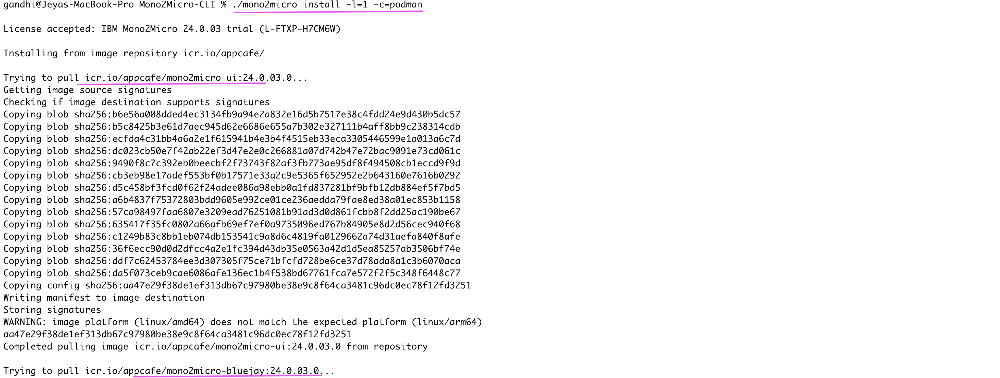
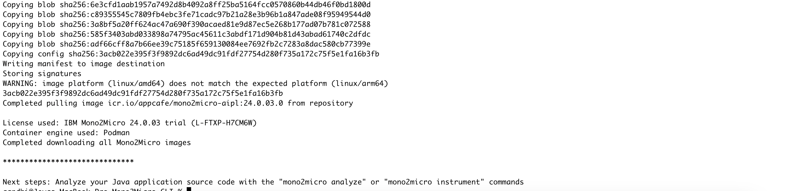

</details>


## 3. Collecting Application Data

<details><summary>CLICK ME</summary>

### 3.1 Static code Analyze

1. Run the `analyze` command to analyze static java binary code. 

```
./mono2micro analyze --srcdir ../Mono2Micro-Example/daytrader/monolith
```

You might have seen the below logs. The detailed log file is available <a href="./files/01-analyse.log">here</a>.

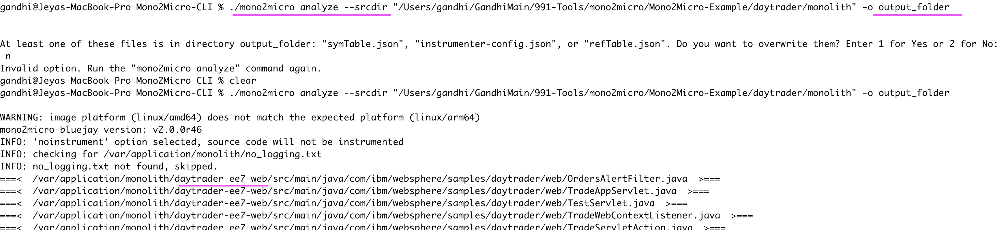
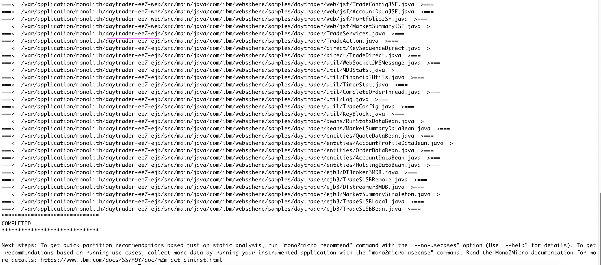

It might have analsysed the `daytrader-ee7-ejb` and `daytrader-ee7-web` as they have source files in them.

2. See the output generated by the analyse command <a href="./files/output_folder">here</a>.

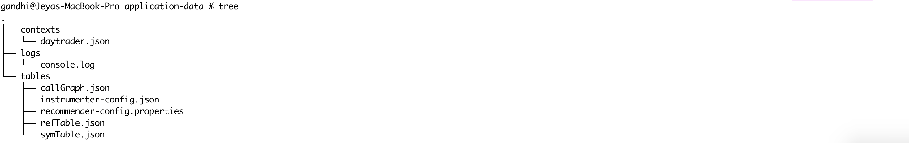

You can see the detailed IBM documentation <a href="https://www.ibm.com/docs/en/mono2micro?topic=data-analyzing-application-code">here</a>.

### 3.2. Analyze with Business Usecases

1. Add the binary instrumenter to collect application data by passing the below parameter while starting your application server.

```
-javaagent:<agent-install-path>/minerva-agent-1.0.jar=<agent-config-path>
```

2. Run the below command to start the usecase recorder.

```
mono2micro usecase -o order.json
```

Here `order.json` is like a usecase name. You can give any name.

3. Now, execute all the steps and tests in your usecase, the mono2micro will capture required logs for the usecases.

4. Repeate the steps 2 and 3 until you complete all the usecases.


You can see the detailed IBM documentation <a href="https://www.ibm.com/docs/en/mono2micro?topic=cad-recording-use-cases-timing-information-use-case-recorder">here</a>.

### 3.3. Application Data

The data collected from both static code and usecases analysis can be kept like the below. See the sample file <a href="./files/application-data">here</a>..

It contains the following.

- static analyser outputs, 
- runtime traces logs from the business case runs 
- use case recorder output in JSON format
</details>


## 4. Creating Mircoservice Partitions

<details><summary>CLICK ME</summary>


1. Run the below command to start creating the Mircoservice partitions. 

The `application-data` created in the above steps should be given us the input to this command.

```
./mono2micro recommend --data-dir=../Mono2Micro-Example/daytrader/application-data
```

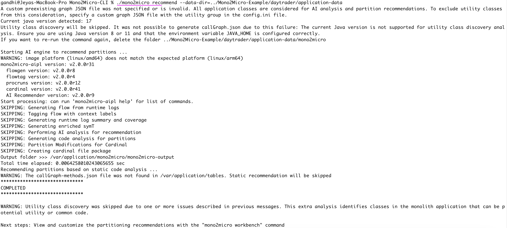

2. The `mono2micro` folder should have been created in the `application-data` folder.

And it should have the 2 below folders.
```
mono2micro-output
mono2micro-workspace
```

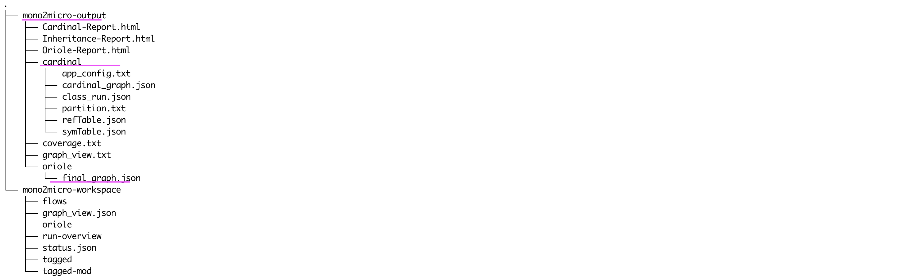


You can see the detailed IBM documentation <a href="https://www.ibm.com/docs/en/mono2micro?topic=recommendations-running-ai-engine-analyze-collected-data">here</a>.

</details>

## 5. Viewing Mircoservice Partitions

<details><summary>CLICK ME</summary>


### 5.1 Open the workbench

1. Run the below command start the workbench. 

```
./mono2micro workbench
```

2. Open the  url http://localhost:3000 in ther browser.

3. Drag and Drop `Mono2Micro-Example/daytrader/mono2micro-analysis/oriole/final_graph.json` file

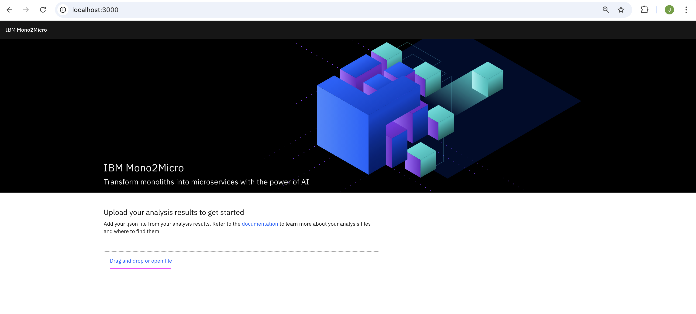

you might be seeing the partitions graph as given below.

### 5.2 Views

#### Business Logic

The Business logic recommendation groups the classes based on runtime calls from business use cases. 

It represents maximum cohesion of use cases and minimum coupling of runtime calls between partitions.


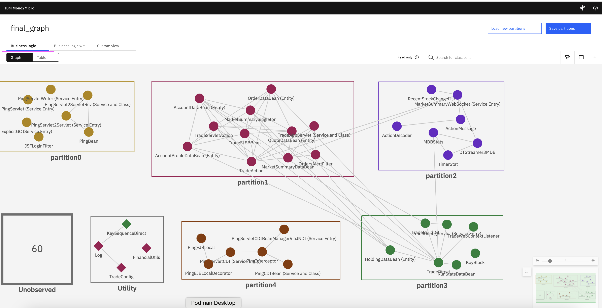

#### Business Logic with class containment

It groups classes based on the same factors as the business logic, while also taking class dependencies into account

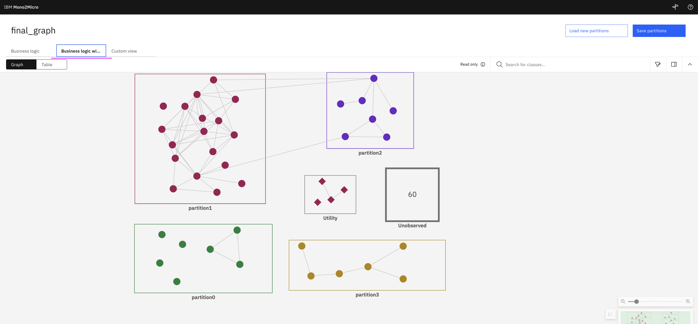

#### Custom view

In the Custom view user can customize the partitions based on thier needs.

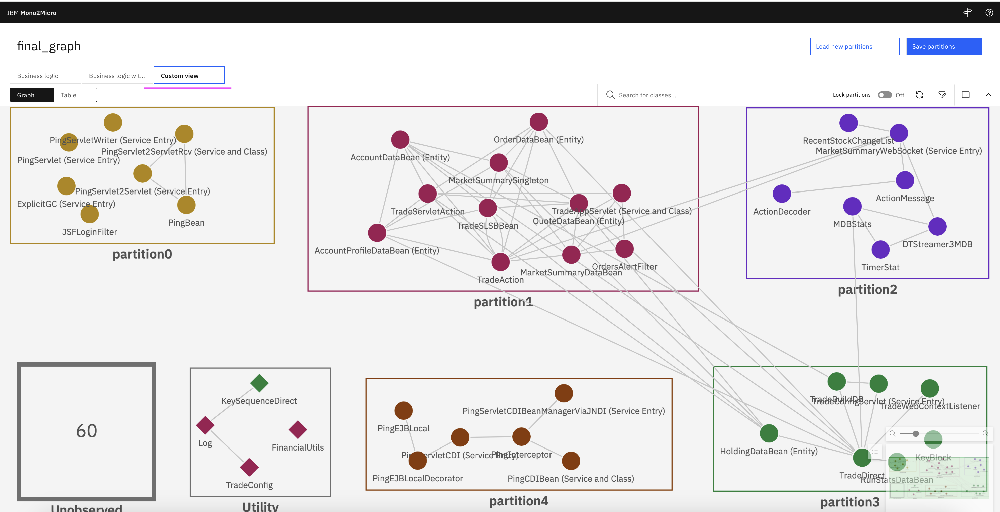

You can drag an class and create new partition as like this.

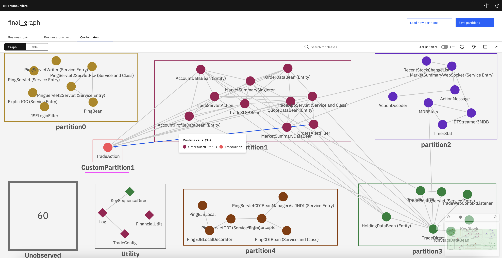

### 5.3 Filter

1. You can apply filter to see the filtered classes.

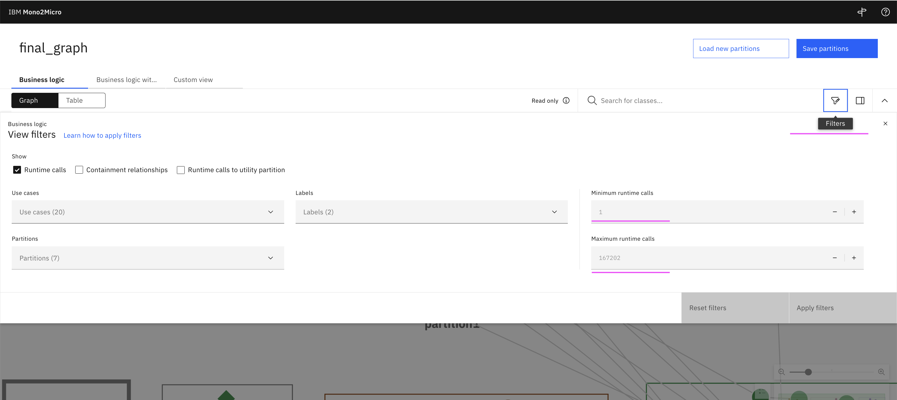

### 5.4 Details

1. The details side panel of the workbench provides detailed information about the selected view, partition, and class.

Currently it shows the detailed information about the about the Custom View page.

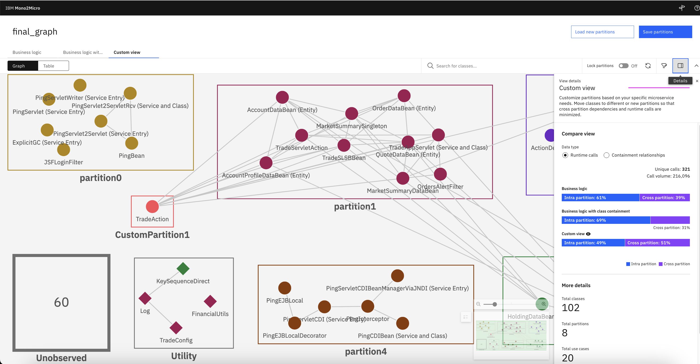


2. Click on any of the class and it shows the detailed view about that class.

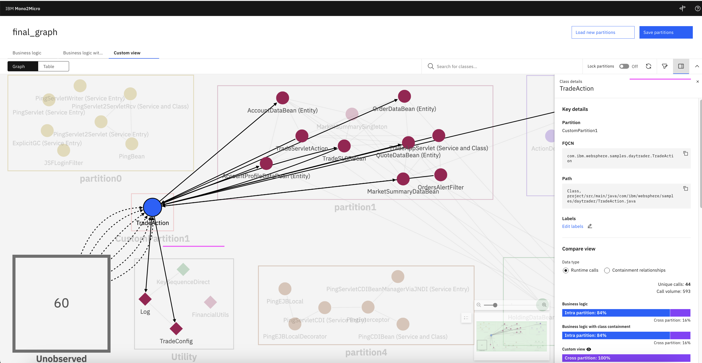

You can see the detailed IBM documentation <a href="https://www.ibm.com/docs/en/mono2micro?topic=viewing-partition-recommendations">here</a>.

</details>

## 6. Microservices Code Generation

<details><summary>CLICK ME</summary>


1. The micorservices code can be generated using the following command.

The parameters are
- The cardinal  partition information files and other files that the code generator uses
- The source code of the monolith application. 

```
./mono2micro transform --srcdir=../Mono2Micro-Example/daytrader/monolith --partitions-info=../Mono2Micro-Example/daytrader/application-data/mono2micro/mono2micro-output/cardinal
```

2. The microservices are created under the `microservices` folder.

</details>

## Reference

https://www.ibm.com/docs/en/mono2micro?topic=mono2micro-overview


https://github.com/IBMTechSales/klp-workshop-labs/tree/master/1152-Mono2Micro-refactorJavaAppsToMicroservices